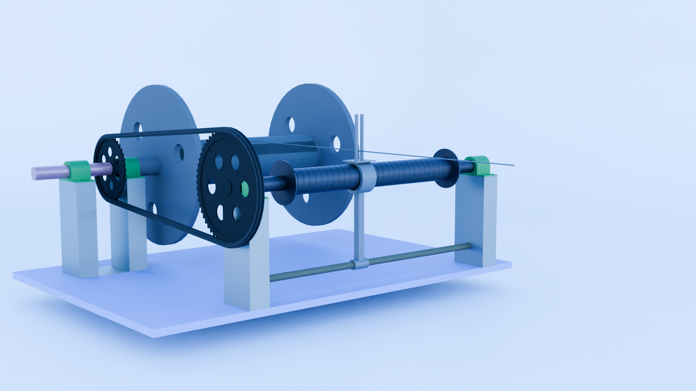

# Cam Roller Mechanism

A cam roller mechanism modeled and assembled in Autodesk Inventor, created by reverse-engineering motion from a Pinterest video reference. No dimensions or drawings were provided, so all measurements and unclear components were designed and interpreted independently.

## Project Purpose

- Practice mechanical design and assembly in Inventor
- Reverse-engineer a mechanism from video reference
- Design custom parts where reference material was unclear

## Features

- Fully modeled cam roller assembly
- Custom-designed cam, roller, shafts, supports, and frame
- Belt and pulley drive system
- Parametric parts for easy modification

# Tools Used

- Autodesk Inventor - Part modeling & assembly
- Blender - Material assignment, rendering and animation
- Pinterest (video reference) - Motion and concept inspiration

## Design Notes

- All dimensions were estimated based on visual proportions
- Design decisions were made using engineering judgment
- Model is intended for learning and demonstration, not manufacturing

## Preview

Visit my [portfolio](https://austin-ngobeni.vercel.app/) to view the animation

## Key Learnings

- Designing without formal drawings
- Translating visual motion into mechanical assemblies
- Improving constraint management and part interaction
